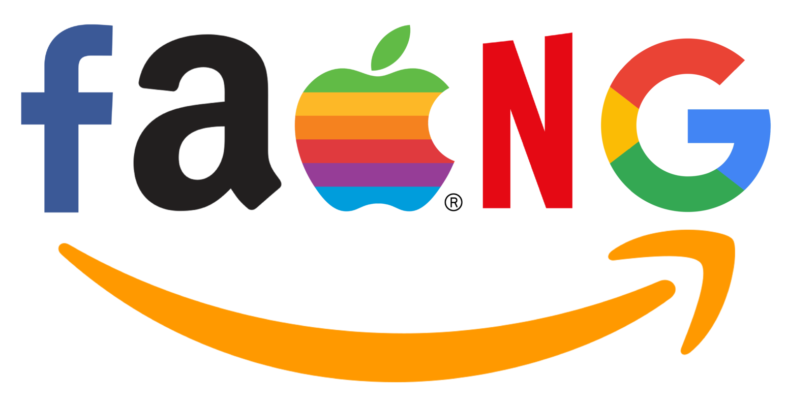

My interest in software engineering comes from a mix of curiosity and enjoyment in building things that people can actually use. I have always liked the idea that a project can start as just an idea and, with enough time and effort, turn into something interactive and useful. When I built projects like a typing test application and a real-time chat app, I realized how rewarding it is to see code come alive, from designing the layout to getting the features to work smoothly. Those projects gave me a taste of what it is like to create something from start to finish, and they made me want to pursue software engineering even more seriously.

My internships also gave me valuable experiences that shaped my interest in this field. At FAST Enterprises, I worked on reports and accessibility improvements, which showed me how important it is to write code that is accurate, reliable, and user friendly. At Blue Startups, I created an interactive map to showcase Hawaiʻi’s startup ecosystem, which taught me how to handle real-world data and present it in a way that others could explore and understand. These experiences showed me that software engineering is not just about writing code. It is about solving problems, collaborating with others, and building tools that make a difference.

Looking ahead, I hope to keep improving both my technical and professional skills. I want to strengthen my abilities in building larger and more complex systems and learn more about cloud technologies, testing, and software design. Just as importantly, I want to grow in areas like teamwork, communication, and leadership, since those skills are critical in any engineering role. Ultimately, my goal is to become a well-rounded software engineer who can contribute to meaningful projects, adapt to new challenges, and keep learning along the way.

```This essay was grammar checked with ChatGPT.```
