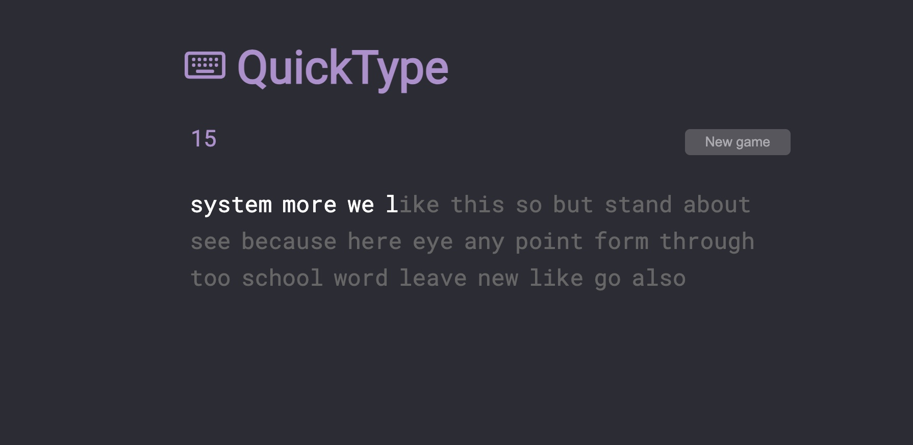

<div class="text-center p-4">
  
</div>

The Full Stack Typing Game is a web-based application designed to evaluate a user’s typing speed and accuracy in an interactive and responsive environment. The game presents users with randomized text passages and tracks their keystrokes in real time, dynamically calculating words per minute, error rates, and overall accuracy. A clean, responsive interface ensures that users can easily test their skills across devices, while the back-end logic manages input processing, scoring, and data consistency. The goal of the project was not only to provide an engaging way to practice typing but also to create an accurate feedback system that allows users to measure progress over repeated sessions.

For this project, I was responsible for developing both the front-end interface and the back-end logic. On the front end, I implemented the real-time tracking features using JavaScript, updating speed and accuracy metrics as the user typed. I also designed the interface with HTML and CSS to ensure that it was responsive and user-friendly. On the back end, I integrated logic to process user input efficiently and handle scoring, ensuring accurate results across different text samples. Beyond the core functionality, I optimized event handling to maintain smooth performance even with rapid keystroke input. By the end of the project, the game provided an engaging, accurate, and intuitive experience for testing typing skills, and it served as a strong demonstration of building a full-stack application from concept to deployment.

Here is some code for the function that deals with getting the words per minute.

```cpp
function getWpm() {
  const words = [...document.querySelectorAll('.word')];
  const lastTypedWord = document.querySelector('.word.current');
  const lastTypedWordIndex = words.indexOf(lastTypedWord) + 1;
  const typedWords = words.slice(0, lastTypedWordIndex);
  const correctWords = typedWords.filter(word => {
    const letters = [...word.children];
    const incorrectLetters = letters.filter(letter => letter.className.includes('incorrect'));
    const correctLetters = letters.filter(letter => letter.className.includes('correct'));
    return incorrectLetters.length === 0 && correctLetters.length === letters.length;
  });
  return correctWords.length / gameTime * 60000;
}
```

